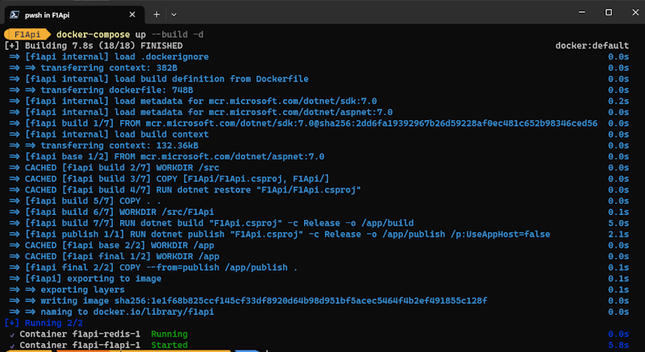

# .NET 7 Minimal API with Delegated Redis Caching

An example API that uses Formula 1 data from a 3rd party to demonstrate fully asynchronous deserialisation of JSON data with Redis caching.

### HttpMessagageHandler interception with DelegatingHandler

By using a DelegatingHandler in the HTTP message handling pipeline, we're able to intercept API requests as they come through from the HttpClient.

This enables us to capture each unique request pattern and build a key for the cache.

The request is passed through to the 3rd party API if nothing is currently cached.

The response is then added to the cache using the unique key.

The next time the same request is made, within the cache timeout period, we'll return the cached response instead.
<br />

### HttpClient injection

We can inject an HttpClient by using the generic ```AddHttpClient<T>``` method of the IServiceCollection.

Then, call ```AddHttpMessageHandler``` on that, passing in the DelegatingHandler:

```csharp
builder.Services.AddHttpClient<ApiSportsClient>()
    .AddHttpMessageHandler<CachedResponseHandler>();
```

### CachedResponseHandler

When an HttpClient calls the SendAsync method, it's actually being called on each of a chain of handlers. 
We can create a custom a custom handler, and inject it into that pipeline. This means we can then chose to call the 
next handler (by calling base.SendAsync) in order to allow the call through, or we can intercept the call and return
our own version of the result - which in this case comes from a previously cached response: 

```csharp
public class CachedResponseHandler : DelegatingHandler
{
    private readonly IDistributedCache _cache;
    private readonly ICacheDateProvider _cacheDateProvider;

    public CachedResponseHandler(IDistributedCache cache, ICacheDateProvider cacheDateProvider)
    {
        _cache = cache;
        _cacheDateProvider = cacheDateProvider;
    }

    protected async override Task<HttpResponseMessage> SendAsync(HttpRequestMessage request, CancellationToken cancellationToken)
    {
        var cacheKey = BuildCacheKey(request).ValueOrDefault; 
        if (string.IsNullOrWhiteSpace(cacheKey))
            return await base.SendAsync(request, cancellationToken);

        var cacheRequest = await GetContentFromCache(cacheKey, cancellationToken);
        if (cacheRequest.IsSuccess)
            return cacheRequest.Value;

        var response = await base.SendAsync(request, cancellationToken);
        await CacheResponseContent(response, cacheKey, cancellationToken);

        return response;
    }

	//...
}
```

### Asynchronously stream and deserialise the response 

When we do have to call out to the 3rd party API, by calling ```ReadAsStreamAsync``` on the HttpContent of the response, and using ```JsonSerializer.DeserializeAsync```, we're able to deserialise directly from the stream, without buffering or preloading:

```csharp
public async Task<Result<IList<T>>> Get<T>(string url, CancellationToken cancellationToken)
{
	var request = new HttpRequestMessage(HttpMethod.Get, new Uri(_uri, url.Trim('/')));
	using var result = await _httpClient.SendAsync(request, HttpCompletionOption.ResponseHeadersRead, cancellationToken);
	if (result == null)
		return Result.Fail("Unable to fetch results from API");

	using var contentStream = await result.Content.ReadAsStreamAsync(cancellationToken);
	var response = await JsonSerializer.DeserializeAsync<ApiResponse<T>>(contentStream, JsonOptions, cancellationToken);
	return response.Data.ToResult();
}
```

# Prerequisites

### Get an API key from: https://dashboard.api-football.com/register

This is a master account that gives you access to several different sports APIs, we'll be using the one for Formula 1 


### Then store it in the Secret Manager:

1. Open a terminal and navigate to the root directory of the project.

2. Run the following command to enable secret storage:

	```dotnet user-secrets init```

3. Then, to store your API key as a secret:

	```dotnet user-secrets set "apisports:api-key" "<YOUR-API-KEY>"```

4. You should get a confirmation like:
1. 
	```Successfully saved apisports:api-key = <YOUR-API-KEY> to the secret store.```

5. You can use the following command to list all secrets from the terminal:

	```dotnet user-secrets list```

### Secrets are automatically injected into the IConfiguration instance

### Usage:
	
```csharp
private const string _apiKeyName = "apisports:api-key";
private const string _apiKeyHeader = "x-apisports-key";

public ApiClient(HttpClient httpClient, IConfiguration config)
{
    var apiKey = config[_apiKeyName];
	_httpClient.DefaultRequestHeaders.Add(_apiKeyHeader, apiKey);
}
```
<br />

# Docker & Redis

The application uses Redis for caching API responses, the easiest way to get up and running with Redis is to use a Docker image.

To get up and running in Docker you'll need Docker Desktop, install it from here (for free) if you don't have it already:

https://www.docker.com/products/docker-desktop/

The application itself also runs in a Docker container, which is built with the ```Dockerfile``` 


### Docker Compose

We have to run both the containers (application and Redis) at the same time in the same _Node_. 

That can be achieved in several ways, ultimately in production you'd use an orchestrator like Kubernetes to manage the containers. 

Initially though, the easiest thing to use is Docker Compose which will just spin them up manually.

### Docker Compose debugging with Visual Studio

The included Docker Compose project (```docker-compose.dcproj```) handles the integration with Visual Studio's debugger. 

Just ensure that the <b>docker-compose</b> project is selected as the Startup Project, and hit F5 to run. 

Visual studio will manage Docker on your behalf.

### Docker Compose debugging with VS Code

Open a terminal at the root directory and run:

```docker-compose up -d --build```

On the first run, this will:
 1. pull down the Redis image from Docker's repo
 2. build the application image using the ```Dockerfile```
 3. create Docker containers for both Redis and the application
 4. create a Docker network
 5. start the containers

 After this it will just rebuild the f1api image and generate a new container



In VS Code, select the **Run & Debug** tab

Then choose the ```Docker .NET Attach``` configuration from the drop down

Hit F5 to run

Select the ```f1api``` container as the debug target


You should then be prompted to copy the .NET debugger into the container:


<br />

# Testing

By default the application's Docker container exposes port 50000, which resolves to port 443 on the application itself.

You can check the current port for your container in Docker Desktop:


Use any REST tool to make a GET request onto the API:

